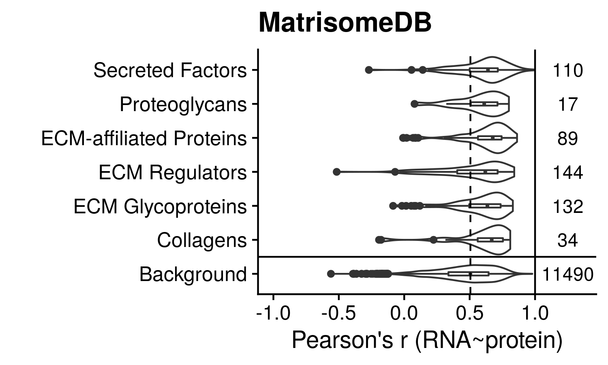

MatrisomeDB: RNA ~ protein correlation in CCLE dataset
================

## Motivation

> Fibrosis stems from the accumulation of excess deposition of
> extracellular matrix components (ECM), which results in thickening
> tissue. We measure ECM-related gene expression as a proxy of cells
> driving this process, but the actual encoding protein levels might not
> be associated to this. Herein we compare mRNA ~ protein levels on this
> regard.

## Load libraries

``` r
library(ggplot2)
library(cowplot)
```

# Load and processed data

First we load the suppl tab 4 from the original paper, with HT-wide
correlation between proteins and
mRNA

``` r
RNAprot <- read.table("./data/ccle/Table_S4_Protein_RNA_Correlation_and_Enrichments_Protein_RNA_correlation.csv",
                      sep=",", header=TRUE)
```

Load the gene set collection defined as part of
MatrisomeDB

``` r
matrisome <- read.table("./data/Matrisome/matrisome_hs_masterlist.csv", sep=",", header=TRUE, stringsAsFactors = FALSE)

# Could we split by category because they are unique of division? yes
stopifnot(all(colSums(table(matrisome$Division, matrisome$Category)!=0)==1))
# Is there any duplicated gene
stopifnot(!any((duplicated(matrisome$Gene.Symbol))))

matrisome_list <- split(matrisome$Gene.Symbol, matrisome$Category)
```

Tranform it into a `Data.frame` for ggplot2 :

``` r
RNAprot.df <- data.frame(Gene=RNAprot$Gene.Symbol,
                         Pearson_Coef=RNAprot$Pearson,
                         Category=rep("Background", length(RNAprot$Gene.Symbol)),
                         stringsAsFactors = FALSE)

for(categ in names(matrisome_list)) {
  idx <- which(RNAprot.df$Gene %in% matrisome_list[[categ]])
  RNAprot.df[idx,"Category"] <- categ
}
RNAprot.df$Category <- factor(RNAprot.df$Category)
RNAprot.df$Category <- relevel(RNAprot.df$Category, ref="Background")
```

## Visualization

``` r
give.n <- function(x){
  return(c(y = 1.25, # A bit beyong max cor coef
           label = length(x)) # the actual tag
         ) 
}

# Show
ggplot(RNAprot.df, aes(y=Pearson_Coef, x=Category)) + 
  geom_violin() + geom_boxplot(width=0.1) +
  scale_x_discrete(position = "bottom") +
  ggtitle("MatrisomeDB") + xlab("") + ylab("Pearson's r (RNA~protein)") + 
  # geom_hline(yintercept = 0, linetype="dashed", size=1) +
  stat_summary(fun.data = give.n, geom = "text", fun.y = median,
              position = position_dodge(width = 0.75)) +
  geom_vline(xintercept = 1.5,size=0.5, color="black") +
  geom_hline(yintercept = 1,size=0.5, color="black") +
  geom_hline(yintercept = median(RNAprot.df$Pearson_Coef[RNAprot.df$Category=="Background"]),
             linetype="dashed", size=0.5, color="black") +
  ylim(-1,+1.35) +
  coord_flip() + theme_cowplot()
```

<!-- -->
